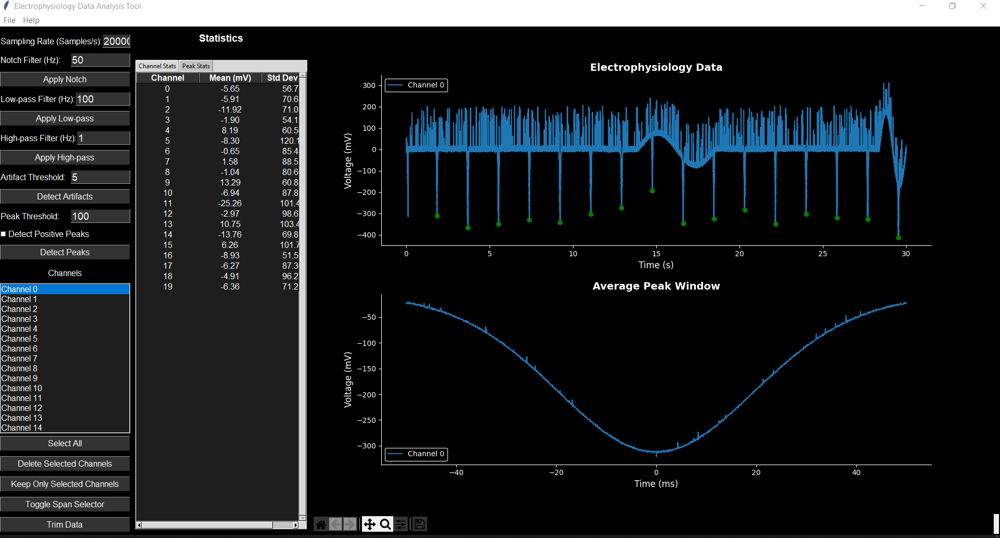

# Electrophysiology Data Analysis Tool

## Description
This tool is designed for analyzing electrophysiological data, including filtering, artifact detection, and peak analysis. It provides a user-friendly graphical interface for loading, processing, and visualizing electrophysiological recordings. 

This software was developed in the context of a project funded by the [Swedish Fund for Research Without Animal Experiments](https://forskautandjurforsok.se/swedish-fund-for-research-without-animal-experiments/) and the [Swedish Research Council](https://www.vr.se/english.html), with contributions from [Leonardo Garma](https://scholar.google.com/citations?user=IyGQ3nwAAAAJ&hl=en&oi=ao), [Kateryna Solodka](https://scholar.google.com/citations?user=dby1cccAAAAJ&hl=en&oi=ao) and [Erica Zeglio](https://scholar.google.com/citations?user=sjLyaVkAAAAJ&hl=en&oi=ao).

The intended application is the analysis of electrophysiological signals from cardiac cells recorded with MEAs, but the software can be used with data from other sources.



## Features
- Load and visualize electrophysiology data
- Apply various filters (notch, low-pass, high-pass)
- Detect and visualize artifacts
- Detect and analyze peaks
- Channel selection and management
- Interactive data trimming
- Statistical analysis of channels and peaks
- Export statistics to Excel

## Installation
1. Clone this repository:
   ```bash
   git clone https://github.com/Leo-GG/ephysGUI
   ```
2. Navigate to the project directory:
   ```bash
   cd ephysGUI
   ```
3. Install the required dependencies:
   ```bash
   pip install -r requirements.txt
   ```

## Usage
Run the main script to start the application:

```
python main.py
```

### Loading Data

1. Click the "Load Data" button to select a .npy file containing your electrophysiological data.
2. The data should be a 2D NumPy array with shape (samples, channels).
3. Enter the sampling rate of your data in the "Sampling Rate (Hz)" field.

### Applying Filters

1. Enter the desired frequency in the appropriate field for the filter you want to apply.
2. Click the corresponding "Apply" button for Notch, Low-pass, or High-pass filters.
3. The filtered data will automatically update in the visualization.

### Detecting Artifacts

1. Enter the artifact threshold value in the "Artifact Threshold" field.
2. Click the "Detect Artifacts" button.
3. Detected artifacts will be highlighted in the main plot.

### Detecting Peaks

1. Enter the peak threshold value in the "Peak Threshold" field.
2. Click the "Detect Peaks" button.
3. Detected peaks will be marked on the main plot, and average peak windows will be shown in the lower plot.

### Visualizing Data

- The main plot shows the selected channels and any detected artifacts or peaks.
- The lower plot displays the average peak windows for selected channels.
- Use the channel selection list on the right to choose which channels to display.
- Use the zoom and pan buttons below the plots to navigate through the data.


## Contributing

Feel free to submit pull requests, create issues, or suggest improvements. For major changes and/or feature requests, please open an issue first to discuss what you would like to change.

## Contact

Leonardo Garma - leonardo.garma@gmail.com

Project Link: [https://github.com/leo-gg/ephysGUI](https://github.com/leo-gg/ephysGUI)
